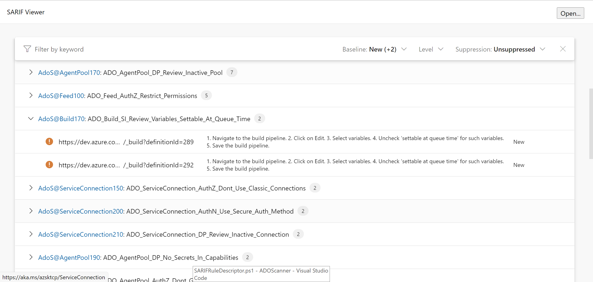

## Generating Logs in SARIF Format


[Static Analysis Results Interchange Format](https://sarifweb.azurewebsites.net/) is a standard output format for static analysis tools. It is a JSON-based format approved as an OASIS standard. It is a universal format used by many different static analysis tools. ADO Scanner provides users a logging format, which they are already familiar with, from other static analysis tools. To read more about SARIF click [here](https://github.com/microsoft/sarif-tutorials/tree/main/docs)

 ADO Scanner provides support to generate SARIF logs in both CA and local scanning modes. The logs are published as "ScanLog-TIMESTAMP.sarif" in the security report folder. Users can generate SARIF logs by adding a switch "-GenerateSarifLogs" or the alias "-gsl" on top of their regular "Get-AzSKADOSecurityStatus" commands. Please refer to the example shown below:

```PowerShell
	Get-AzSKADOSecurityStatus -OrganizationName "<orgName>" -ProjectName "<projName>" -GenerateSarifLogs
```

The generated logs can be used with any SARIF tool available online. A few functionalities with ADO Scanner sarif files include:

- Enhanced viewing of ADO Scanner logs in [Visual Studio and VSCode](https://sarifweb.azurewebsites.net/#Viewers).
- Enhanced viewing of ADO Scanner logs on an online [web viewer](https://microsoft.github.io/sarif-web-component/).
- Filing work items in Azure Boards for the generated SARIF logs.
- Comparing newly generated SARIF file with old SARIF files to find out what has changed from the last run.
- Other functionalities provided by SARIF tools.

Sample output of SARIF in the [web viewer](https://microsoft.github.io/sarif-web-component/)
<kbd>
  
</kbd>

###  Useful SARIF commands for npm SDK

Please [refer here](https://github.com/microsoft/sarif-sdk) to setup the SARIF SDK. After the setup is complete you can run the following commands:

Creating work items on Azure Boards using SARIF logs: 
```PowerShell
        $env:SarifWorkItemFilingPat= "PAT Token"
        npx @microsoft/sarif-multitool file-work-items pathToSarifLogs/logs.sarif --host-uri https://dev.azure.com/OrgName/ProjName --split PerResult
```

Compare previous run SARIF logs with newly generated SARIF logs:
```PowerShell
    npx @microsoft/sarif-multitool match-results-forward newSARIFLogs.sarif -r oldSarifLogs.sarif -o ComparedLogsOutput.sarif
```

For other useful commands and more details on the above commands, please refer [here](https://github.com/microsoft/sarif-sdk/blob/main/docs/multitool-usage.md).

